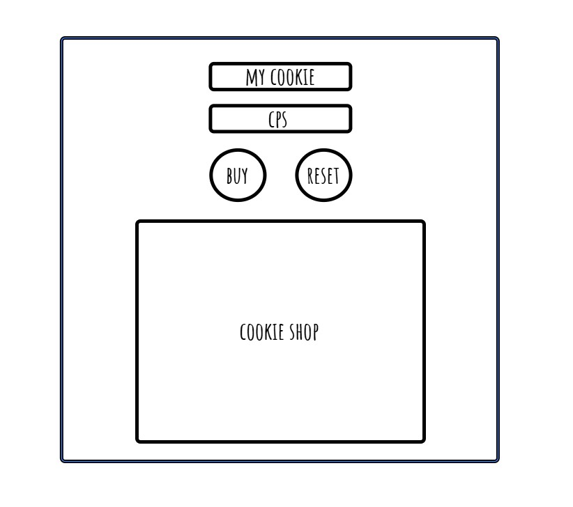
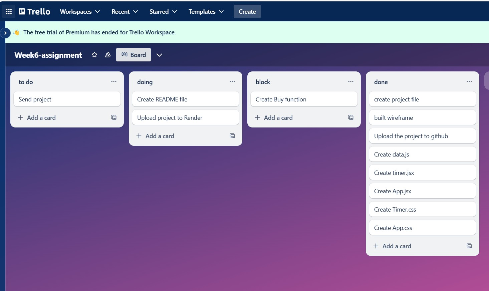

Project name: Cookie Clicker Game

Render link: 

Repo link: [Repo Link](https://github.com/eminehorozoglu/week6-assignment-)

Project description:

1 cookie is received every second in the program. You can receive additional cookies when you click on the cookie image. You can see the cookie you receive per second in the "Cps" ​​field.

You can increase the cookie value received per second from the Cookie Shop section. The price of each cookie is written next to it. When your total cookies are sufficient, you can make the purchase by pressing the buy button. If you do not have enough credit, the purchase process will not be realized.

You can reset all your data with the Reset button.

Wireframe :

Buy Project Plan :

Reflections:

1- I was able to fetch the data and display it on the screen, but I couldn't watch it in Timer.jsx. So I created a data.js file and entered the cookie data here. In this way, I was able to process the data.

2- When I wrote the code to get cookies per second, I couldn't get the data to work properly. The counter was going fast. When I defined [cps] in UseEffect, this problem was fixed.

3- I added the image as in the js file and it didn't work. Later, in my research, I found the image adding code for React and ran it. In this way, I was able to define a function for the cookie image.

4- Although I applied display: flex and align-items: center on the CSS page to center the cookie shop area on the page, I could not bring it to the center. So I brought it to the center of the page by applying the "Center" command.

